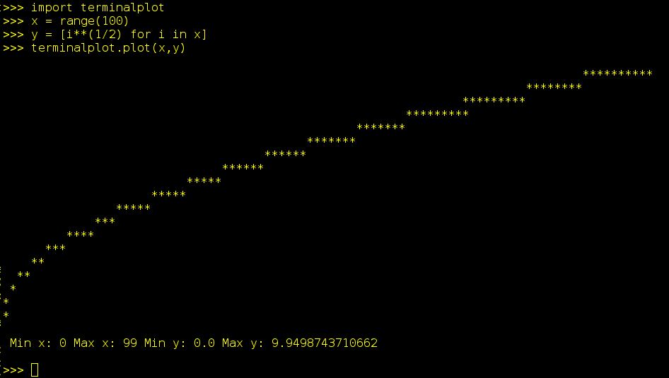

############
terminalplot
############

************
Installation
************
.. code-block::

  pip install terminalplot

*****
Usage
*****

Command Line
============
Get size of terminal emulator (tty)::

  $ plot -s
  > Rows: 25 Columns: 80

Plot some points::

  $ plot -x '-1 0 1 2 3 4' -y '0.1 0.2 0.23 0.234 0.24'

API
===
Plotting a graph:: python

  from terminalplot import plot
  x = range(100)
  y = [i**2 for i in x]
  plot(x, y)

Get size of current terminal window:: python

  from terminalplot import get_terminal_size
  get_terminal_size()

